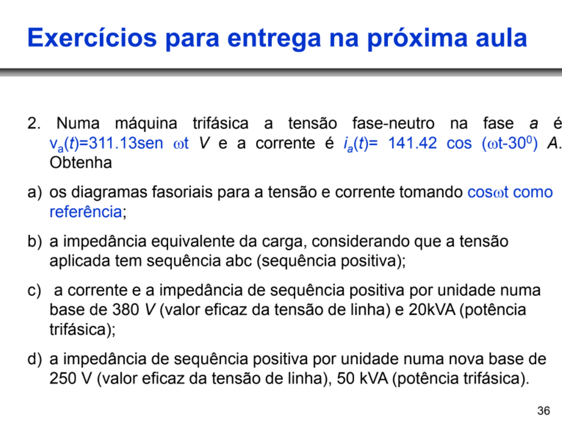

----
###### Análise de Sistemas de Energia Elétrica
###### Desenvolvido por José Lucas Damasceno Holanda  
----
<h1>Lista de Exercícios Nº 1</h1>

----

Segue, a seguir, a solução da primeira questão: 

<h3>1.A)</h3>

Nesta questão, deve-se encontrar o valor de , assumindo que possui mesma direção e sentido aprensentado na Figura acima. Desta forma, calcula-se  pelo método das malhas: 

    

Tendo o fasor de corrente, é possível calcular as potências aparentes de  e  para determinar, assumindo o sentido da corrente, qual das duas fontes é a geradora e a consumidora.

    

Com isso, sendo o sentido da corrente saindo da fonte  e a potência ativa com sinal positivo, esta fonte de tensão está fornecendo tensão para o sistema que contém uma impedância em série com a fonte de tensão .

----
<h3>1.B)</h3>

Para determinar as potências P e Q absorvidas pela impedância utilizam-se as tensões das fontes e a corrente obtida no item 1.a)

    

----
<h3>1.C)</h3>

Considerando que a diferença angular entre as fontes  e é igual ou próxima de zero, pode-se utilizar a seguinte consideração para calcular a máxima potência transferível da Fonte 1 para a Fonte 2: 

    

----
<h3>1.D)</h3>

A potência demandada pela barra de carga é calculada pela equação abaixa: 

    

----
<h3>1.E)</h3>

Considerando a inserção de um capacitor de 2, 5  em série com a reatância indutiva da linha, obteve-se primeiro a corrente do novo sistema por meio de: 

    

Logo em seguida, calcula-se as componentes da potência aparente da nova impedância da linha: 

    

Por conseguinte, considerando que a abertura angular entre as duas fontes de tensão é a menor possível, calcula-se a máxima transferências de potência por meio de: 

    

Por fim, Calcula-se a potência demandada na fonte de carga: 

    

----

----

Segue, a seguir, a solução da primeira questão: 

<h3>2.A)</h3>

Considerando a função  como referência, obteve-se os fasores de tensão e de corrente do motor:

    

Com isso, admitindo a referência citada acima, obtém-se o valor referenciado para a corrente:

    

----
<h3>2.B)</h3>

Para obter a impedância equivalente, considerando a carga em Y, têm-se:

    

----
<h3>2.C)</h3>

Calculando e obtendo a impedância e a corrente em sistema por unidade:

    

Calculando a corrente em pu:

    

----
<h3>2.D)</h3>

Calculando e obtendo a impedância e a corrente em sistema por unidade no novo sistema base:

    

Calculando a tensão em pu:

    

Calculando a corrente em pu:

    

----

>Em caso de necessidade de correções, entrar em contato vai github ou via e-mail jose.holanda@ee.ufcg.edu.br
