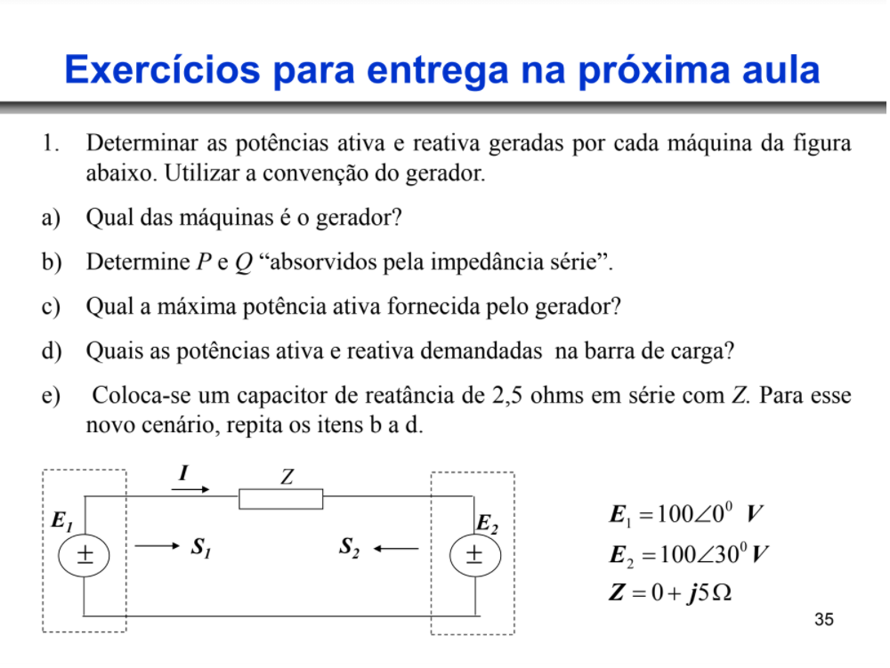

#
>Análise de Sistemas de Energia Elétrica
>
>Desenvolvido por José Lucas Damasceno Holanda
#

<h1>Lista de Exercícios Nº 1</h1>

----

Segue, a seguir, a solução da primeira questão: 

<h3>1.A)</h3>

Nesta questão, deve-se encontrar o valor de $\hat{I}$, assumindo que possui mesma direção e sentido aprensentado na Figura acima. Desta forma, calcula-se $\hat{I}$ pelo método das malhas: 

$
\begin{aligned}
-\hat{E_1} +\hat{I}Z +\hat{E_2}  & = 0 \\
\hat {I} &                         = \frac{\hat{E_1}-\hat{E_2}}{Z} \\
\hat {I} &                         = \frac{100\angle 0\degree - 100\angle 30\degree}{5j} \\
\hat {I} &                         = 10, 35 \angle-165\degree  A\\
\end{aligned}
$

Tendo o fasor de corrente, é possível calcular as potências aparentes de $\hat{E_1}$ e $\hat{E_2}$ para determinar, assumindo o sentido da corrente, qual das duas fontes é a geradora e a consumidora.

$
\begin{aligned}
S_1 & = -\hat{E_1}*\hat{I}^* \\
S_1 & = 999,  99 - j267, 95 \\
S_1 & = 1035, 27\angle-15\degree  VA \\
\end{aligned}
$

Com isso, sendo o sentido da corrente saindo da fonte $\hat{E_1}$ e a potência ativa com sinal positivo, esta fonte de tensão está fornecendo tensão para o sistema que contém uma impedância em série com a fonte de tensão $\hat{E_2}$.

----
<h3>1.B)</h3>

Para determinar as potências P e Q absorvidas pela impedância utilizam-se as tensões das fontes e a corrente obtida no item 1.a)

$
\begin{aligned}
S_Z & = (\hat{E_1}-\hat{E_2})\hat{I}^* \\
S_Z & = 0 + j535, 6 \\
S_Z & = P_Z + jQ_Z \\
P_Z & = 0 W \\
Q_Z & = 535,      89 var\\
\end{aligned}
$

----
<h3>1.C)</h3>

Considerando que a diferença angular entre as fontes $\hat{E_1}$ e $\hat{E_2}$ é igual ou próxima de zero, pode-se utilizar a seguinte consideração para calcular a máxima potência transferível da Fonte 1 para a Fonte 2: 

$
\begin{aligned}
P_{MAX} & = \frac{E_1E_2}{X} \\
        & = \frac{100*100}{5} \\
P_{MAX} & = 2000 W \\
\end{aligned}
$

----
<h3>1.D)</h3>

A potência demandada pela barra de carga é calculada pela equação abaixa: 

$
\begin{aligned}
S_2 & = \hat{E_2}*\hat{I}^* \\
    & = -999, 99 -j267, 95 VA \\
\end{aligned}
$

----
<h3>1.E)</h3>

Considerando a inserção de um capacitor de 2, 5 $\Omega$ em série com a reatância indutiva da linha, obteve-se primeiro a corrente do novo sistema por meio de: 

$$
\begin{aligned}
-\hat{E_1} +\hat{I}(j5 -j2,5) + \hat{E_2} & = 0 \\
 \hat {I} & = \frac{\hat{E_1}-\hat{E_2}}{j2,5} \\
          & = -20 -j5, 3589 A \\
          & = 20,7055\angle-165\degree A \\
\end{aligned}
$$

Logo em seguida, calcula-se as componentes da potência aparente da nova impedância da linha: 

$$
\begin{aligned}
S_Z & = (\hat{E_1}-\hat{E_2})\hat{I}^* \\
    & = 1071,7955\angle 90\degree VA \\
    & = 0 + j1071, 7955 VA
\end{aligned}
$$

Por conseguinte, considerando que a abertura angular entre as duas fontes de tensão é a menor possível, calcula-se a máxima transferências de potência por meio de: 

$$
\begin{aligned}
P_{MAX} & = \frac{100*100}{2,5} \\
        & = 4000 W \\
\end{aligned}
$$

Por fim, Calcula-se a potência demandada na fonte de carga: 

$$
\begin{aligned}
S_2 & = (100\angle 30\degree)\hat{I}^* \\
    & = -1999, 99 - j535, 89 VA \\
    & = 2070,  55\angle -165\degree VA
\end{aligned}
$$

----
$$
\begin{aligned}
rascunho
\end{aligned}
$$