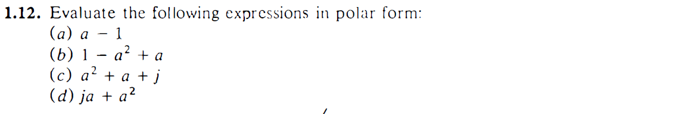
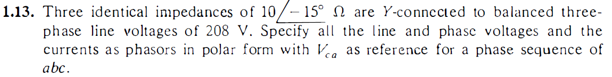
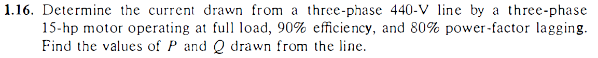
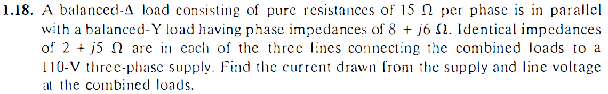
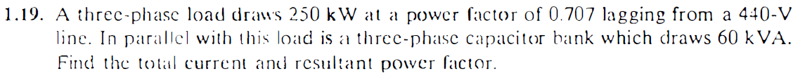
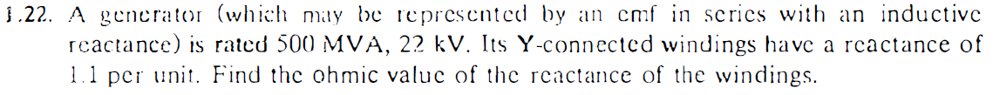
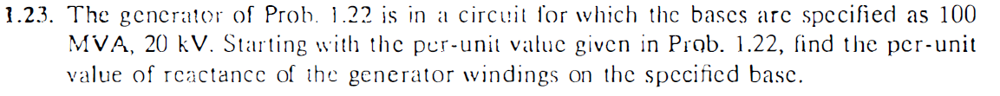

----
###### Análise de Sistemas de Energia Elétrica
###### Desenvolvido por José Lucas Damasceno Holanda  
----
<h1>Lista de Exercícios Nº 2</h1>

Segue, a seguir, a solução da questão 1.12: 

<h3>1.12 A)</h3>

    

<h3>1.12 B)</h3>

    

<h3>1.12 C)</h3>

    

<h3>1.12 D)</h3>

    

----

    

    

----

    

----

    

    

----

----

    

    

----

    

----

    

----

>Em caso de necessidade de correções, entrar em contato via github ou via e-mail jose.holanda@ee.ufcg.edu.br
